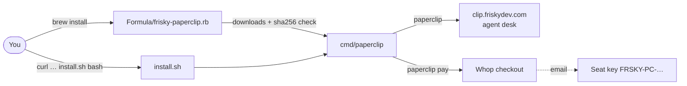

# FR!sky Paperclip — Homebrew tap

 

The agent desk. [clip.friskydev.com](https://clip.friskydev.com)

```bash
brew install FriskyDevelopments/paperclip/frisky-paperclip
paperclip
```

Without Homebrew:

```bash
curl -fsSL https://raw.githubusercontent.com/FriskyDevelopments/homebrew-paperclip/main/install.sh | bash
```

Seat key arrives by Whop email (`FRSKY-PC-…`).
Pay: https://whop.com/checkout/plan_4WRbqNWxmh5SG

Native Apple-notarized `Paperclip.app` still ships on Whop. This tap installs the desk launcher.

## How it works

The tap installs a small Bash launcher (`cmd/paperclip`, v0.1.1) that opens the hosted desk or Whop checkout in your default browser. `install.sh` does the same without Homebrew. It installs into `~/.local/bin` and adds a desktop entry on Linux or an app shim in `~/Applications` on macOS.



| Command | What it does |
|---|---|
| `paperclip` | Open the desk |
| `paperclip pay` | Open Whop checkout |
| `paperclip --version` / `--help` | Version / usage |
| `curl … install.sh \| bash -s -- uninstall` | Remove the non-Homebrew install |

Optional overrides (names only): `PAPERCLIP_DESK`, `PAPERCLIP_PAY`. `install.sh` also reads `PAPERCLIP_RAW` and `PAPERCLIP_PREFIX`.

Updating the tap: when `cmd/paperclip` changes, bump `version` and update the `sha256` in `Formula/frisky-paperclip.rb` so it matches the raw file.

## License

See [LICENSE.md](LICENSE.md). © 2026 Frisky Developments LLC.
